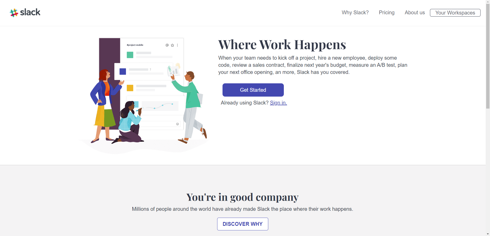

# Slack clon

## Índice

- [Objetivo](#Objetivo)
- [Demo](#Demo)
- [Tecnologías](#Tecnologías)
- [Descripción](#Descripción)
- [Contacto](#contacto)
- [Saber más](#Saber-más)

## Objetivo

El objetivo de este proyecto era refrescarmis habilidades de maquetación, con especial atención al responsive.
Para ello, me he basado en los diseños que se pueden ver en la siguiente imagen, con diferentes distribuciones de elementos en función de los diferentes anchos de pantalla.

## Demo

[Puedes ver el resultado de mi trabajo aquí](https://www.gonzalo.pro/labs/slack_clon/)

## Tecnologías

- HTML
- CSS
- BOOTSTRAP

## Saber más

<!-- Meter aquí un enlace al post que haya publicado en el blog (en caso de haberlo) -->

## Contacto

